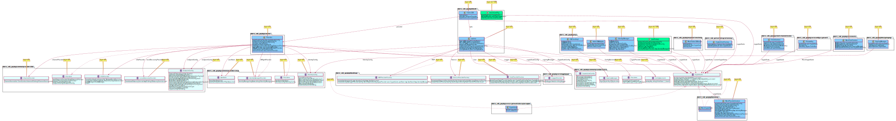

显示struct/interface的依赖关系，如果试图显示整个项目的依赖关系，图太复杂了没有办法看阿。

#!/bin/sh

C=go-package-plantuml
GOPATH=/gp
PROJECT=/gp/src/github.com/hyperledger/fabric-sdk-go/
OUTPUTDIR=~/docs/plantuml
plantjmlJar=/gp/bin/plantuml.jar

NODENAME=$1

for x in 1 2
do
    echo "$C --codedir $PROJECT --gopath $GOPATH --outputdir $OUTPUTDIR \
         --nodename NODENAME --nodedepth $x \
         --ignoredir $PROJECT/internal \
         --ignoredir $PROJECT/third_party"
    $C --codedir $PROJECT --gopath $GOPATH --outputdir $OUTPUTDIR \
        --nodename $NODENAME --nodedepth $x \
        --ignoredir $PROJECT/internal \
        --ignoredir $PROJECT/third_party \
        --ignorenode closable \
        --ignorenode closeable
    sed -i 's/github.com\\\\hyperledger\\\\//g' $OUTPUTDIR/node-$NODENAME-$x.puml
    java -Xmx2048m -jar /gp/bin/plantuml.jar $OUTPUTDIR/node-$NODENAME-$x.puml -tsvg
done

- FabricSDK一级依赖

- FabricSDK二级依赖

